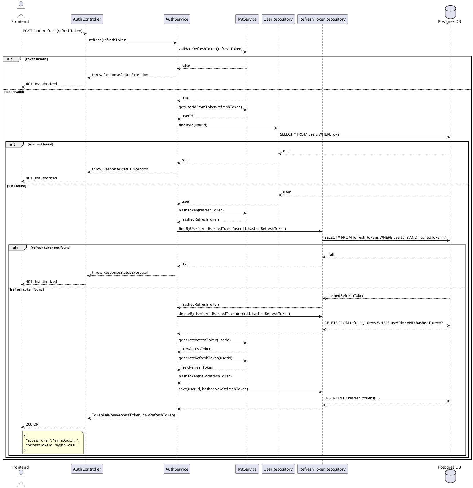

# Token Refresh Flow

This diagram shows the token refresh sequence:

```puml
@startuml
actor Frontend as FE
participant AuthController as AC
participant AuthService as AS
participant JwtService as JS
participant UserRepository as UR
participant RefreshTokenRepository as RTR
database "Postgres DB" as DB

FE -> AC: POST /auth/refresh(refreshToken)
AC -> AS: refresh(refreshToken)
AS -> JS: validateRefreshToken(refreshToken)

alt token invalid
    JS --> AS: false
    AS --> AC: throw ResponseStatusException
    AC --> FE: 401 Unauthorized
    else token valid
        JS --> AS: true
        AS -> JS: getUserIdFromToken(refreshToken)
        JS --> AS: userId
        AS -> UR: findById(userId)
        UR -> DB: SELECT * FROM users WHERE id=?
        alt user not found
            DB --> UR: null
            UR --> AS: null
            AS --> AC: throw ResponseStatusException
            AC --> FE: 401 Unauthorized
            else user found
                DB --> UR: user
                UR --> AS: user
                AS -> JS: hashToken(refreshToken)
                JS --> AS: hashedRefreshToken
                AS -> RTR: findByUserIdAndHashedToken(user.id, hashedRefreshToken)
                RTR -> DB: SELECT * FROM refresh_tokens WHERE userId=? AND hashedToken=?
                alt refresh token not found
                    DB --> RTR: null
                    RTR --> AS: null
                    AS --> AC: throw ResponseStatusException
                    AC --> FE: 401 Unauthorized
                    else refresh token found
                        DB --> RTR: hashedRefreshToken
                        RTR --> AS: hashedRefreshToken
                        AS -> RTR: deleteByUserIdAndHashedToken(user.id, hashedRefreshToken)
                        RTR -> DB: DELETE FROM refresh_tokens WHERE userId=? AND hashedToken=?
                        DB --> RTR
                        RTR --> AS
                        AS -> JS: generateAccessToken(userId)
                        JS --> AS: newAccessToken
                        AS -> JS: generateRefreshToken(userId)
                        JS --> AS: newRefreshToken
                        AS -> AS: hashToken(newRefreshToken)
                        AS -> RTR: save(user.id, hashedNewRefreshToken)
                        RTR -> DB: INSERT INTO refresh_tokens(...)
                        DB --> RTR:
                        RTR --> AS
                        AS --> AC: TokenPair(newAccessToken, newRefreshToken)
                        AC --> FE: 200 OK
                            note right of FE
                                {
                                  "accessToken": "eyJhbGciOi...",
                                  "refreshToken": "eyJhbGciOi..."
                                }
                            end note
                end
        end
end
@enduml
```