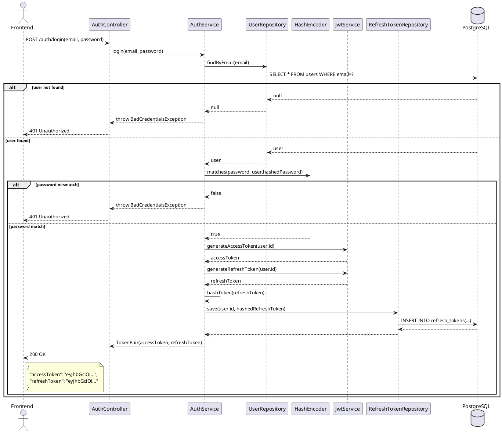

# Login Flow

This diagram shows the login sequence:

```puml
@startuml
actor "Frontend" as FE
participant "AuthController" as AC
participant "AuthService" as AS
participant "UserRepository" as UR
participant "HashEncoder" as HE
participant "JwtService" as JS
participant "RefreshTokenRepository" as RTR
database "PostgreSQL" as DB

FE -> AC: POST /auth/login(email, password)
AC -> AS: login(email, password)

AS -> UR: findByEmail(email)
UR -> DB: SELECT * FROM users WHERE email=?
alt user not found
    DB --> UR: null
    UR --> AS: null
    AS --> AC: throw BadCredentialsException
    AC --> FE: 401 Unauthorized
else user found
    DB --> UR: user
    UR --> AS: user
    AS -> HE: matches(password, user.hashedPassword)
    alt password mismatch
        HE --> AS: false
        AS --> AC: throw BadCredentialsException
        AC --> FE: 401 Unauthorized
    else password match
        HE --> AS: true
        AS -> JS: generateAccessToken(user.id)
        JS --> AS: accessToken
        AS -> JS: generateRefreshToken(user.id)
        JS --> AS: refreshToken
        AS -> AS: hashToken(refreshToken)
        AS -> RTR: save(user.id, hashedRefreshToken)
        RTR -> DB: INSERT INTO refresh_tokens(...)
        DB --> RTR
        RTR --> AS
        AS --> AC: TokenPair(accessToken, refreshToken)
        AC --> FE: 200 OK
            note right of FE
                {
                  "accessToken": "eyJhbGciOi...",
                  "refreshToken": "eyJhbGciOi..."
                }
            end note
    end
end
@enduml
```