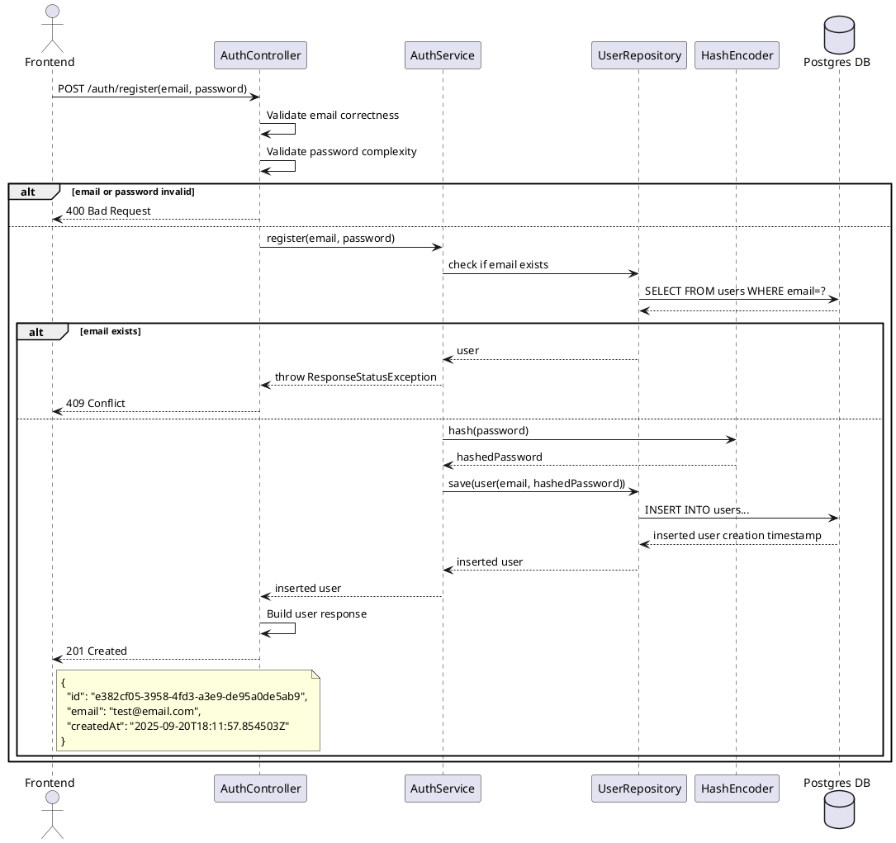

# User Registration Flow

This diagram shows the user registration sequence:

```puml
@startuml
actor "Frontend" as FE
participant "AuthController" as Controller
participant "AuthService" as Service
participant "UserRepository" as Repository
participant "HashEncoder" as Hasher
database "Postgres DB" as DB

FE -> Controller: POST /auth/register(email, password)
Controller -> Controller: Validate email correctness
Controller -> Controller: Validate password complexity
alt email or password invalid
    Controller --> FE: 400 Bad Request
else
    Controller -> Service: register(email, password)
    Service -> Repository: check if email exists
    Repository -> DB: SELECT FROM users WHERE email=?
    DB --> Repository
    alt email exists
        Repository --> Service: user
        Service --> Controller: throw ResponseStatusException
        Controller --> FE: 409 Conflict
    else
        Service -> Hasher: hash(password)
        Hasher --> Service: hashedPassword
        Service -> Repository: save(user(email, hashedPassword))
        Repository -> DB: INSERT INTO users...
        DB --> Repository: inserted user creation timestamp
        Repository --> Service: inserted user
        Service --> Controller: inserted user
        Controller -> Controller: Build user response
        Controller --> FE: 201 Created
            note right of FE
                {
                  "id": "e382cf05-3958-4fd3-a3e9-de95a0de5ab9",
                  "email": "test@email.com",
                  "createdAt": "2025-09-20T18:11:57.854503Z"
                }
            end note
    end
end
@enduml
```